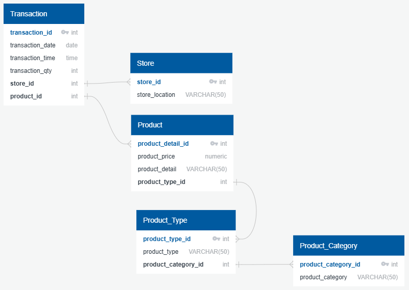
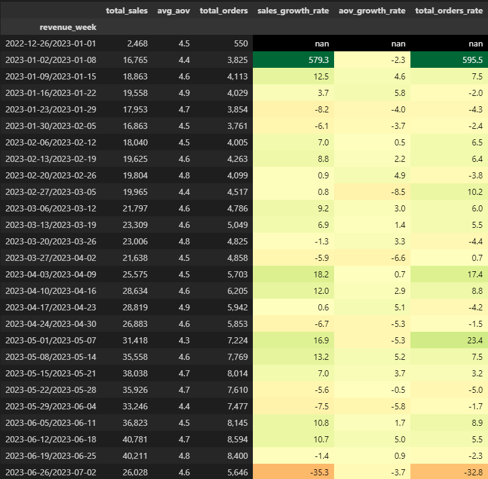
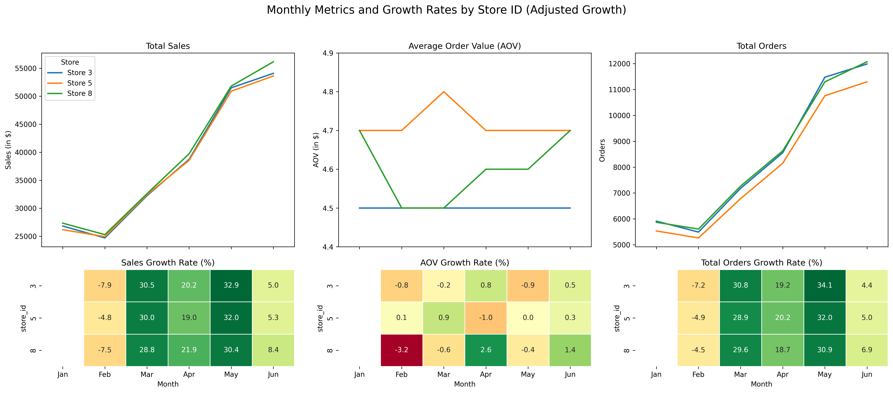

# EspressoYourself - Biannual Analysis

>For more of my data projects and journey, visit my [Portfolio](https://this.me).

Table of Contents

- [Project Background](#project-background)
- [Executive Summary](#executive-summary)

## Project Background
Espresso Yourself is an energetic coffee shop franchise that opened its doors this year. They aim to change the coffee game with top-notch brews.

To boost their performance and grow their market presence, Espresso Yourself has teamed up with us to dive into their sales data and uncover actionable insights. This collaboration is led by their COO, who is keen on using data-driven strategies to improve business operations.

## Executive Summary
Espresso Yourself's analysis of 149k records across first half of 2023 shows sales with value of 702,000$ with each of three stores contributing at 33% of sales.

The Coffee and Tea categories are essential to this business, accounting for an impressive 67% of total revenue. This highlights the significant impact these products have on the company's financial performance, reflecting their strong demand and crucial role in driving overall sales and growth.

Expanding the top category product lines, creating bundle offers and launching a customer loyalty program can significantly enhance the performance of all three stores. Additionally, marketing campaigns on social networks and utilizing glass storefront displays will boost visibility and engagement. This strategy aims to drive customer retention and growth, thereby strengthening the market position and ensuring sustainable success for the business.

_Yourself Espresso ERD_

## Insights Deep-Dive

### Sales Trends and Growth Rates
- Espresso Yourself has a projection of $1,4 millions in annual sales with 300,000 orders per year.
- 

_Weekly Growth Rates_

_Monthly Growth Rates_
### Average Monthly Sales with Orders per Month

### Decline/Uprise Sales on Specific Month due to X

### Possible Seasonality Sales

### Stores % Contribution

### Unexpected Growth or Metric

## Recommendations

### Maximizing Product Offerings

## Clarifying Questions, Assumptions, and Caveats

### Questions for Stakeholders Prior to Project Advancement

### Assumptions and Caveats